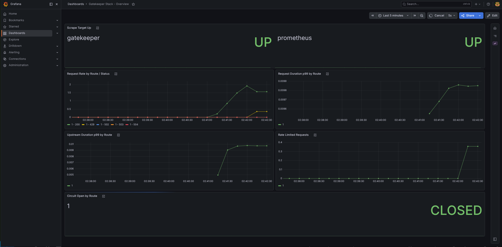
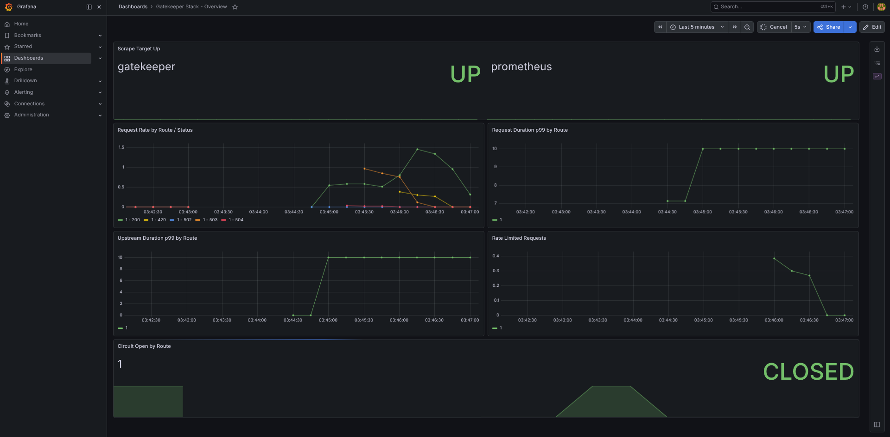
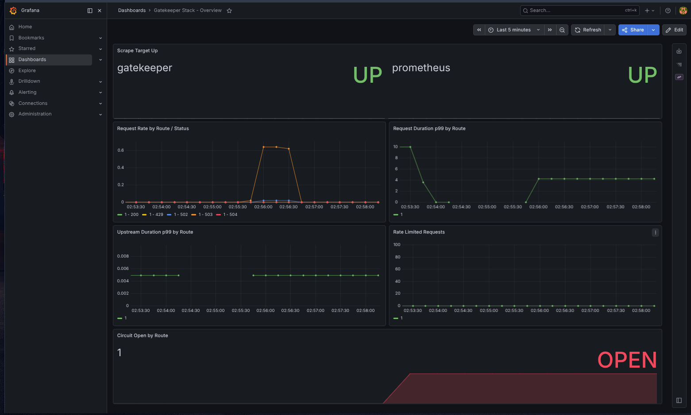

A self-hostable API gateway built with FastAPI. Sits in front of your services and handles rate limiting, circuit breaking, API key auth, structured logging, and live analytics — without touching upstream code.

---

## Architecture

Every request flows through a per-route middleware chain. `logger` and `proxy` are fixed (first and last); the rest are declared per-route in `routes.yaml`.

```
                 ┌────────────────────────────────────────────────────┐
                 │                    GateKeeper                       │
  client ──────► │ logger → auth → rate-limiter → circuit-breaker → proxy │ ──────► upstream
                 └────────────────────────────────────────────────────┘
                         │           │              │            │
                         ▼           ▼              ▼            ▼
                   access logs   Redis/in-mem   Redis/in-mem   httpx client
                   (JSON lines)  API key store  limiter state  (connection pool)
```

- `logger` — stamps request start time, emits one JSON access log line per request on completion.
- `auth` — validates `X-API-Key` against SHA-256 hashes stored in Redis (optional or mandatory per config).
- `rate-limiter` — token bucket or sliding window, keyed by API key or client IP, backed by Redis Lua scripts (or in-memory if no Redis).
- `circuit-breaker` — per-route failure tracking with CLOSED / OPEN / RECOVERY states.
- `proxy` — forwards to the upstream via a pooled `httpx.AsyncClient`, strips hop-by-hop headers, rewrites `Host`/`X-Forwarded-*`.

Metrics from every request feed `/gatekeeper/metrics` (rolling window summary) and, if enabled, Prometheus at `/metrics`.



---

## Features

- **Reverse proxy** — longest-prefix route matching, optional path-prefix stripping, per-route timeouts.
- **Rate limiting** — `token_bucket` or `sliding_window`, per-API-key or per-IP, atomic via Redis Lua scripts.
- **Circuit breaker** — per-route CLOSED → OPEN → RECOVERY state machine with configurable thresholds and a single-probe recovery.
- **API key auth** — `X-API-Key` header checked against SHA-256 hashes in Redis; optional or mandatory.
- **Structured logging** — one JSON line per request (route, status, latency, rate-limit/circuit-breaker outcome).
- **Live analytics** — rolling-window summary (`/gatekeeper/metrics`) and a WebSocket dashboard feed (`/gatekeeper/dashboard`).
- **Prometheus metrics** — request counts, latency histograms, rate-limit and circuit-breaker gauges (`/metrics`, opt-in).
- **Pluggable storage** — Redis-backed for multi-instance state, or in-memory for single-instance/dev.
- **Health/readiness endpoints** — `/gatekeeper/health` (liveness) and `/gatekeeper/ready` (storage connectivity).

---

## Quickstart

```bash
git clone https://github.com/le-Affan/gatekeeper.git
cd gatekeeper
docker compose up -d
```

This brings up GateKeeper (`:8080`), Redis, a mock upstream (`:8000`), Prometheus (`127.0.0.1:9090`), and Grafana (`127.0.0.1:3000`).

Default routes (`src/config/routes.yaml`):

```yaml
routes:
  - route_id: 0001
    path_prefix: /api/user
    upstream_URL: http://mock-upstream:8000
    timeout: 30
    strip_prefix: true
    middleware_names:
      - auth
      - rate-limiter
      - circuit-breaker
    metadata: {}

  - route_id: 0002
    path_prefix: /api/user/admin
    upstream_URL: http://mock-upstream:8000
    timeout: 60
    strip_prefix: true
    middleware_names:
      - auth
      - rate-limiter
      - circuit-breaker
    metadata: {}
```

```bash
curl http://localhost:8080/api/user/
```

---

## Configuration

All settings are read from environment variables (or `.env`), defined in `src/config/settings.py`. Names are case-insensitive.

| Variable | Type | Default | Description |
|---|---|---|---|
| `REDIS_URL` | `Optional[str]` | `None` | Redis connection string. If unset, falls back to in-memory storage (single instance only). |
| `GATEWAY_PORT` | `int` | `8080` | Port the gateway listens on. |
| `LOG_LEVEL` | `str` | `INFO` | Python logging level. |
| `METRICS_WINDOW_SECONDS` | `int` | `60` | Rolling window size for `/gatekeeper/metrics` summary stats. |
| `ENABLE_PROMETHEUS` | `bool` | `false` | Exposes `/metrics` in Prometheus exposition format when true; returns 404 otherwise. |
| `AUTH_REQUIRE_AUTH` | `bool` | `false` | If true, requests without a valid `X-API-Key` are rejected (401/403). If false, missing keys pass through unauthenticated. |
| `RATE_LIMIT_ALGORITHM` | `str` | `sliding_window` | `sliding_window` or `token_bucket`. |
| `RATE_LIMIT_API_KEY_HEADERS` | `List[str]` | `["x-api-key", "authorization", "api-key", "apikey"]` | Headers checked (in order) to identify a client for rate limiting before falling back to IP. |
| `RATE_LIMIT_CAPACITY` | `int` | `100` | Token bucket: max tokens (burst size). |
| `RATE_LIMIT_REFILL_RATE` | `float` | `10.0` | Token bucket: tokens refilled per second. |
| `RATE_LIMIT_LIMIT` | `int` | `100` | Sliding window: max requests per window. |
| `RATE_LIMIT_WINDOW_SECONDS` | `int` | `60` | Sliding window: window size in seconds. |
| `RATE_LIMIT_TRUST_FORWARDED_FOR` | `bool` | `false` | If true, trusts inbound `X-Forwarded-For` for client identification. Only enable behind a trusted proxy/LB. |
| `CB_FAILURE_THRESHOLD` | `int` | `5` | Failures within `CB_WINDOW_SECONDS` required to trip CLOSED → OPEN. |
| `CB_WINDOW_SECONDS` | `float` | `60.0` | Rolling window for counting failures. |
| `CB_RECOVERY_TIMEOUT` | `float` | `30.0` | Time after tripping OPEN before a probe request is allowed (OPEN → RECOVERY). |
| `CB_SUCCESS_THRESHOLD` | `int` | `1` | Consecutive successful probes required to close the circuit (RECOVERY → CLOSED). |

---

## Benchmarks

`wrk`-based load tests, gateway vs. raw upstream (`mock-upstream`), single gateway worker:

| Benchmark | Result | Notes |
|---|---|---|
| Raw upstream | 4,771 req/sec | Baseline, no gateway in path. |
| Gateway (`c=50`) | 476 req/sec, **1.4ms** p99 latency overhead | Full middleware chain (auth + rate-limiter + circuit-breaker + proxy). |
| Gateway (`c=200`) | 346 req/sec | Throughput drops under higher concurrency — single uvicorn worker is the ceiling. |
| Rate limiter accuracy | 100/500 concurrent requests allowed, 0 over-admission | Sliding window, limit=100; exact admission under burst load. |
| Circuit breaker | Opens within 60s of backend failure, recovers in under 90s | Full CLOSED → OPEN → RECOVERY → CLOSED cycle under sustained traffic. |



---

## Circuit Breaker

Per-route state machine (`src/middleware/circuit_breaker.py`), state stored in memory per `CircuitBreaker` instance:

- **CLOSED** — normal operation. Failed responses (no response, or status ≥ 500) are recorded in a rolling window. If `CB_FAILURE_THRESHOLD` failures occur within `CB_WINDOW_SECONDS`, the circuit trips to **OPEN**.
- **OPEN** — all requests fail fast with `503 Service Unavailable` and a `Retry-After` header; no upstream call is made. After `CB_RECOVERY_TIMEOUT` seconds, the next request is admitted as a single probe and the circuit moves to **RECOVERY**.
- **RECOVERY** (half-open) — exactly one probe request is in flight at a time. A successful probe increments a success counter; once it reaches `CB_SUCCESS_THRESHOLD`, the circuit closes (back to **CLOSED**). A failed probe immediately reopens the circuit and restarts the recovery timer.

State is per route (`route_id`) and per gateway process — see [Known Limitations](#known-limitations).



---

## Management API

```bash
# Liveness — process is up
curl http://localhost:8080/gatekeeper/health
# {"status": "ok"}

# Rolling-window analytics summary
curl http://localhost:8080/gatekeeper/metrics
# {
#   "requests_per_second": ...,
#   "error_rate_percent": ...,
#   "rate_limit_rate_percent": ...,
#   "circuit_open_rate_percent": ...,
#   "latency_ms": {"p50": ..., "p95": ..., "p99": ..., "avg": ...},
#   "per_route": {...}
# }

# Loaded route table
curl http://localhost:8080/gatekeeper/routes
# {"routes": [{"route_id": "0001", "path_prefix": "/api/user", ...}, ...]}
```

Other endpoints: `/gatekeeper/ready` (storage connectivity), `/gatekeeper/dashboard` (WebSocket live feed), `/metrics` (Prometheus, requires `ENABLE_PROMETHEUS=true`).

---

## Custom Routes

Add an entry to `src/config/routes.yaml`:

```yaml
routes:
  - route_id: 0003
    path_prefix: /api/v1
    upstream_URL: http://your-service:8000
    timeout: 30
    strip_prefix: true
    middleware_names:
      - auth
      - rate-limiter
      - circuit-breaker
    metadata: {}
```

Requests to `/api/v1/*` are forwarded to `http://your-service:8000/*` (prefix stripped). Route matching is longest-prefix-first, so more specific prefixes (e.g. `/api/user/admin`) take priority over shorter ones (`/api/user`). `middleware_names` must reference middleware registered in `_build_registry` (`auth`, `rate-limiter`, `circuit-breaker`); `logger` and `proxy` are implicit.

---

## Demo

```bash
sudo bash scripts/demo.sh
```

Runs background traffic against `/api/user/`, then injects a 30-second total network partition to `mock-upstream` via `tc netem` (root required for `tc`). Watch the **Gatekeeper Stack - Overview** dashboard at `http://localhost:3000`:

- `gatekeeper_circuit_open`: `0` → `1` (trips OPEN) → `0` (recovers to CLOSED)
- Request status codes: `2xx` → `502`/`504` (fault) → `503` (circuit open, fast-fail) → `2xx`
- Upstream duration stops updating while OPEN (no upstream calls are made)

---

## Known Limitations

- **Single worker only** — `prometheus_client`'s default registry is per-process; running multiple uvicorn workers would scatter `/metrics` across them. Scaling requires Prometheus multiprocess mode.
- **In-memory circuit breaker state** — circuit state lives in the `CircuitBreaker` instance of a single process. Running multiple gateway instances gives each its own independent circuit per route.
- **Not a drop-in Nginx/Envoy replacement** — no TLS termination, HTTP/2, WebSocket proxying (beyond the dashboard), or config hot-reload. Built for learning and small/internal deployments.

---

Built by Affan Shaikh ([le-Affan](https://github.com/le-Affan)) — every line written from first principles.
